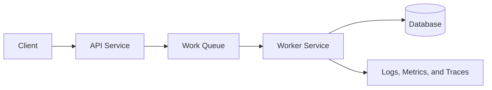
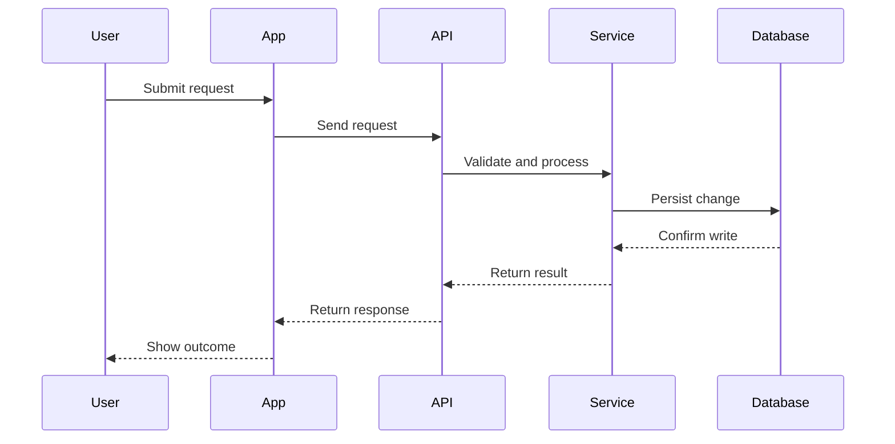
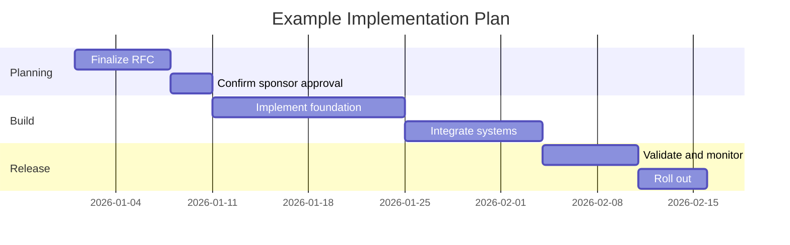

# RFC: Template

## Metadata

| Field | Value |
| --- | --- |
| RFC Owner |  |
| Sponsor |  |
| Sponsor Role |  |
| Business Case |  |
| Status | Draft |
| Created | YYYY-MM-DD |
| Last Updated | YYYY-MM-DD |
| Review Date | YYYY-MM-DD |

The sponsor must be an architect, VP, or another person with appropriate technical authority. The sponsor should also be able to explain the business case for the proposed change.

## Required Review Artifacts

Every RFC must include a completed threat model and readiness review in the same RFC folder.

- [Threat model](threat-model.md)
- [Readiness review](readiness-review.md)

## Executive Summary

Provide a high-level explanation of the problem being solved and the proposed solution.

## Problem Statement

Provide a detailed description of the problem being solved and why it is important to solve it.

## Goals and Motivation

List the objectives of the solution and why the RFC is important.

Example:

- Improve reliability for a critical workflow
- Reduce operational cost or complexity
- Enable a new business capability
- Standardize an architecture or technical approach

## Known Requirements

List existing requirements that need to be met.

This section does not replace a PRD. It should provide a short list that sets context and guides the RFC.

Example:

- Must support existing customers without downtime
- Must meet security and compliance requirements
- Must include an operational support plan
- Must be observable through existing monitoring tools

## Proposed Solution

Describe the selected solution.

This can include:

- Technology being used
- Architectural approach
- System boundaries
- Data flow
- Scaling considerations
- Redundancy or failover approach
- Security considerations
- Operational considerations
- Cost implications

### Architecture Diagram

Use Mermaid for diagrams whenever possible.

### Interaction Diagram

Mermaid documentation:

- [Mermaid documentation](https://mermaid.js.org/intro/)
- [Flowchart syntax](https://mermaid.js.org/syntax/flowchart.html)
- [Sequence diagram syntax](https://mermaid.js.org/syntax/sequenceDiagram.html)
- [State diagram syntax](https://mermaid.js.org/syntax/stateDiagram.html)
- [Gantt syntax](https://mermaid.js.org/syntax/gantt.html)

## Impacts and Risks

Identify the impact the solution will have on the business and outline any risks that reviewers need to be aware of.

Risks may be categorized using ROAM:

| Risk | Impact | ROAM Status | Owner | Mitigation or Notes |
| --- | --- | --- | --- | --- |
|  |  | Resolved / Owned / Accepted / Mitigated |  |  |

ROAM definitions:

- Resolved: The risk has been addressed.
- Owned: Someone is accountable for managing the risk.
- Accepted: The risk is understood and accepted.
- Mitigated: Actions are planned or complete to reduce the risk.

## Questions to Answer

List open questions that still need to be explored.

| Question | Owner | Status | Notes |
| --- | --- | --- | --- |
|  |  | Open |  |

## Implementation Plan

Provide a detailed description of how the work will be broken down and executed.

Example implementation timeline:

Implementation details:

- Phase 1:
- Phase 2:
- Phase 3:
- Rollout plan:
- Rollback plan:
- Operational handoff:

## Alternatives Considered

Describe other alternatives considered to meet this RFC. Explain why these were eliminated in favor of the chosen approach.

| Alternative | Summary | Why It Was Not Chosen |
| --- | --- | --- |
|  |  |  |

## Supporting Materials

Add links or references to supporting materials.

Examples:

- Product requirements
- Architecture documents
- Design documents
- Data analysis
- Cost estimates
- Proofs of concept
- Related pull requests or issues

## Review Notes

Use this section to capture important review decisions, follow-ups, or changes made during the RFC process.

| Date | Note | Owner |
| --- | --- | --- |
|  |  |  |
